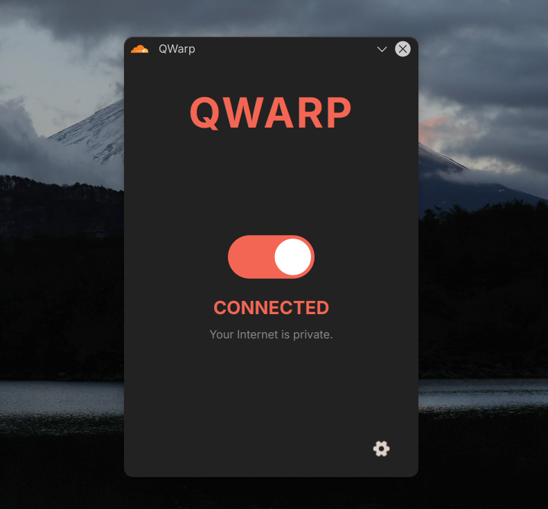

<div align="center">
  

  # QWarp

  [](https://github.com/iashutoshtiwari/qwarp/stargazers)
  [](https://github.com/iashutoshtiwari/qwarp/network/members)
  [](https://github.com/iashutoshtiwari/qwarp/issues)
  [](https://github.com/iashutoshtiwari/qwarp/blob/master/LICENSE)

  A lightweight, Wayland-native Qt6 GUI wrapper for the `cloudflare-warp-bin` service on Linux.
</div>

> [!WARNING]
> **Early Development:** QWarp is currently in very early development. It is **not** a 1:1 replacement for the official Cloudflare WARP application and may lack certain advanced features or stability. Expect bugs and breaking changes as the project evolves.

> [!IMPORTANT]
> **Disclaimer:** This is an unofficial community project and is not affiliated with, authorized, maintained, sponsored, or endorsed by Cloudflare.

## Screenshots

<div align="center">
  <h3>Main UI</h3>
  
  <br><br>
  <h3>System Tray Area</h3>
  
</div>

## Features

- **System Integrations**: Lightweight UI, Wayland compatibility, and theme-aware tray icon tinting.
- **Daemon Control**: Connect/Disconnect from WARP visually and switch routing modes (DoH, DoT, Proxy).
- **Diagnostics**: View offline account telemetry (License, Registration) locally.
- **Service Recovery**: Auto-detects stopped WARP services and provides a one-click `pkexec` recovery button.
- **Non-intrusive**: Resides entirely in the system tray, toggles on click, and cleans up conflicting official GUIs automatically.

## Installation

### Arch Linux (Recommended)

You can install using the AUR using any AUR helper like `yay`:
```bash
yay -S qwarp
```

Or you can install using the provided `PKGBUILD`:
```bash
git clone https://github.com/iashutoshtiwari/qwarp.git
cd qwarp
makepkg -si
```

### Generic Linux Binary
Download the pre-compiled `qwarp-linux-x86_64.tar.gz` from the Releases section:
```bash
tar -xzvf qwarp-linux-x86_64.tar.gz
./qwarp
```

### Development
```bash
pip install .
qwarp
```

## Requirements
To actually proxy traffic, the official `cloudflare-warp-bin` package must be installed and the `warp-svc` daemon enabled.

## Known Issues
This application is currently in very early development. As such, it may possess very little functionality and have incomplete features. Expect breaking changes and bugs as the core stabilizes.

## Contribution
Any kind of contribution is highly welcome! Whether it's reporting bugs, suggesting new features, or submitting pull requests, I appreciate community input to help build out the application.

## Authors
- [@iashutoshtiwari](https://www.github.com/iashutoshtiwari)
