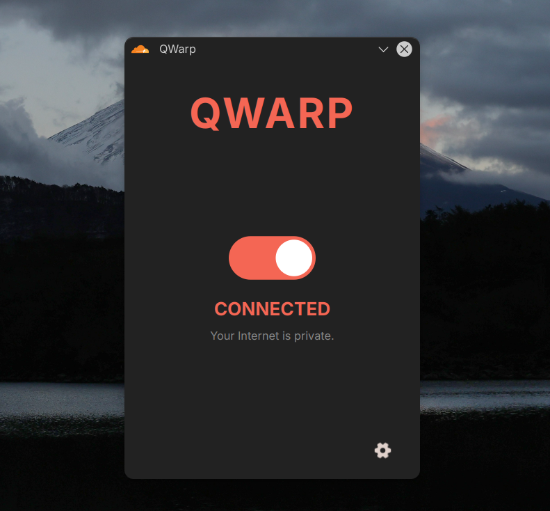

<div align="center">
  

  # QWarp

  [](https://github.com/iashutoshtiwari/qwarp/stargazers)
  [](https://github.com/iashutoshtiwari/qwarp/network/members)
  [](https://github.com/iashutoshtiwari/qwarp/issues)
  [](https://github.com/iashutoshtiwari/qwarp/blob/master/LICENSE)

  A lightweight, Wayland-native Qt6 GUI wrapper for the official Cloudflare WARP client on Linux.
</div>

> [!WARNING]
> **Early Development:** QWarp is currently in very early development. It is **not** a 1:1 replacement for the official Cloudflare WARP application and may lack certain advanced features or stability. Expect bugs and breaking changes as the project evolves.

> [!IMPORTANT]
> **Disclaimer:** This is an unofficial community project and is not affiliated with, authorized, maintained, sponsored, or endorsed by Cloudflare.

## Screenshots

<div align="center">

| Main UI | System Tray Area |
|:---:|:---:|
|  |  |

<sub>*Screenshots captured on KDE Plasma 6 with the Darkly style.*</sub>

</div>


## Features

- **Official Cloudflare backend**: Controls the official `warp-cli` and `warp-svc`; QWarp does not bundle or replace Cloudflare's client.
- **Consumer and Zero Trust onboarding**: Accept the WARP Terms, create a consumer registration, or enroll with a Cloudflare Zero Trust organization.
- **Connection controls**: Connect or disconnect WARP and select supported WARP, DNS-over-HTTPS, DNS-over-TLS, and proxy modes.
- **Account management**: View registration and organization details, apply a WARP+ license, and leave or replace a registration.
- **Connection settings**: Configure tunnel protocol, proxy port, Families DNS filtering, and trusted-network behavior where allowed by the installed client and organization policy.
- **Diagnostics and recovery**: Inspect daemon, network, override, and split-tunnel information, and repair a stopped WARP service through `pkexec`.
- **Linux desktop integration**: Wayland-native Qt6 UI, X11 support, system tray operation, XDG autostart, theme-aware icons, and optional suppression of the official Cloudflare tray icon.
- **Localized interface**: Includes English, German, Spanish, Portuguese, Italian, Chinese, Japanese, and Hindi catalogs.

## Installation

QWarp is a frontend for Cloudflare's official Linux client. Install the official
client for your distribution first, then install QWarp. The package is named
`cloudflare-warp` on Debian, Ubuntu, and Fedora, and `cloudflare-warp-bin` on
Arch Linux.

### Debian/Ubuntu

Add Cloudflare's official APT repository and install the WARP client:

```bash
sudo apt-get install curl gnupg lsb-release
curl -fsSL https://pkg.cloudflareclient.com/pubkey.gpg \
  | sudo gpg --yes --dearmor \
      --output /usr/share/keyrings/cloudflare-warp-archive-keyring.gpg
echo "deb [signed-by=/usr/share/keyrings/cloudflare-warp-archive-keyring.gpg] https://pkg.cloudflareclient.com/ $(lsb_release -cs) main" \
  | sudo tee /etc/apt/sources.list.d/cloudflare-client.list
sudo apt-get update
sudo apt-get install cloudflare-warp
```

Download `qwarp_0.9.0-1_all.deb` from the
[v0.9.0 release](https://github.com/iashutoshtiwari/qwarp/releases/tag/v0.9.0),
then install it with APT:

```bash
sudo apt install ./qwarp_0.9.0-1_all.deb
```

See [Cloudflare's package repository](https://pkg.cloudflareclient.com/) for
the currently supported Debian and Ubuntu releases and key-rotation notices.

### Fedora

Add Cloudflare's official RPM repository and install the WARP client:

```bash
sudo rpm --import https://pkg.cloudflareclient.com/pubkey.gpg
curl -fsSL https://pkg.cloudflareclient.com/cloudflare-warp-ascii.repo \
  | sudo tee /etc/yum.repos.d/cloudflare-warp.repo
sudo dnf update
sudo dnf install cloudflare-warp
```

Download `qwarp-0.9.0-1.fc44.noarch.rpm` from the
[v0.9.0 release](https://github.com/iashutoshtiwari/qwarp/releases/tag/v0.9.0),
then install it with DNF:

```bash
sudo dnf install ./qwarp-0.9.0-1.fc44.noarch.rpm
```

See [Cloudflare's package repository](https://pkg.cloudflareclient.com/) for
the currently supported Fedora releases. Cloudflare documents RHEL and CentOS
separately because their client packages may require EPEL.

### Arch Linux

Install QWarp from the AUR with an AUR helper such as `yay`:

```bash
yay -S qwarp
```

The AUR package declares `cloudflare-warp-bin` as a required dependency, so an
AUR helper installs both packages.

To build the repository `PKGBUILD` directly, install the AUR dependency first:

```bash
yay -S cloudflare-warp-bin
git clone https://github.com/iashutoshtiwari/qwarp.git
cd qwarp
makepkg -si
```

### Generic Linux Binary

Install the official Cloudflare client using the appropriate instructions
above. Then download `qwarp-0.9.0-linux-x86_64.tar.gz` and `SHA256SUMS` from the
[v0.9.0 release](https://github.com/iashutoshtiwari/qwarp/releases/tag/v0.9.0).
Verify the downloaded archive, extract it, and run QWarp:

```bash
sha256sum --ignore-missing --check SHA256SUMS
tar -xzf qwarp-0.9.0-linux-x86_64.tar.gz
./qwarp
```

The generic binary is for x86_64 Linux and bundles its Python and Qt runtime,
but it still requires the separately installed Cloudflare daemon and CLI.

### Development

Python 3.11 or newer is required. Install QWarp and its development tools in an
isolated environment:

```bash
python -m venv .venv
source .venv/bin/activate
python -m pip install -e ".[dev]"
qwarp
```

### Agent-assisted maintenance

Any LLM or coding agent working on this repository must read and follow
[`AGENTS.md`](AGENTS.md) before changing code, packaging, CI, or release
configuration. Agent tooling is optional maintainer infrastructure and is not
required to build, install, use, or contribute to QWarp.

## Requirements

QWarp requires Linux, the official `warp-cli` and `warp-svc`, and a supported
system tray for tray-resident operation. The main window remains usable when a
system tray is unavailable.

The official Cloudflare package must remain installed:

- Debian, Ubuntu, Fedora, RHEL, and CentOS: `cloudflare-warp`
- Arch Linux: `cloudflare-warp-bin`

Cloudflare's package normally manages the daemon. If the service is not
running, enable it manually:

```bash
sudo systemctl enable --now warp-svc
```

> [!NOTE]
> **Upgrading from the self-contained QWarp 0.8.2-1 package:** Prefer upgrading
> with an AUR helper. If the old package conflict prevents dependency
> installation, remove `qwarp`, install `cloudflare-warp-bin`, reinstall
> `qwarp`, and enable `warp-svc` again. The legacy removal hook may stop and
> disable the service during this transition.

QWarp supports both consumer WARP registrations and Cloudflare Zero Trust
organization enrollment. Available modes and settings can still be restricted
by the installed Cloudflare client version or an organization's device policy.

## Release process

Releases are prepared from `master` through the manually dispatched Release
workflow. It validates tests, translations, generic archives, Arch packages,
Debian packages, RPM packages, version metadata, source checksums, and a
maintainer-completed live QA checklist before the protected `release`
environment can publish GitHub and AUR updates. The workflow never rewrites
`master` or generates changelog commits after tagging. Published tags and
release assets are immutable; fixes must target a later version instead of
replacing an existing release.

## Contribution

Any kind of contribution is highly welcome! Whether it's reporting bugs, suggesting new features, or submitting pull requests, I appreciate community input to help build out the application.

## Authors

- [@iashutoshtiwari](https://www.github.com/iashutoshtiwari)
