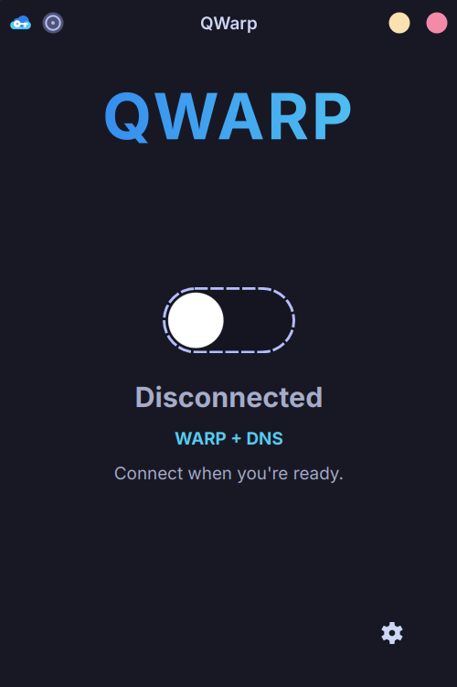
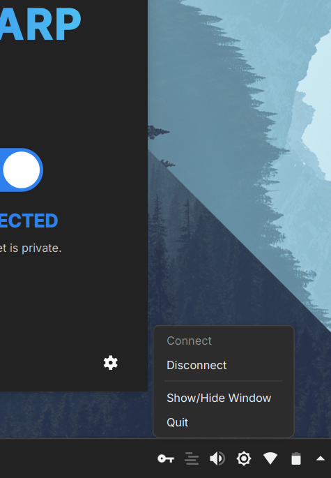

<div align="center">
  

# QWarp

A Qt6-based alternative desktop client for Cloudflare® WARP® on Linux.

[](https://github.com/iashutoshtiwari/qwarp/actions/workflows/ci.yml)
[](https://github.com/iashutoshtiwari/qwarp/releases/latest)
[](https://aur.archlinux.org/packages/qwarp)
[](LICENSE)

</div>

> [!IMPORTANT]
> QWarp is independently developed and is not affiliated with, authorized, sponsored, or endorsed by Cloudflare, Inc.
> It controls a separately installed official client and does not distribute or replace `warp-cli`, `warp-svc`, or
> software published by Cloudflare, Inc. See the project [trademark notice](TRADEMARKS.md).

Cloudflare, 1.1.1.1, WARP, and WARP+ are trademarks and/or registered trademarks of Cloudflare, Inc. in the United
States and other jurisdictions.

QWarp is pre-1.0 software. Features and interfaces may still change, and organization policy can restrict the actions
available to Zero Trust users.

## Screenshots

<div align="center">
  
  
  
  <br>
  <em>Captured on KDE Plasma 6 with the Darkly theme applied.</em>
</div>

## What QWarp provides

- Consumer WARP registration and Cloudflare Zero Trust enrollment
- Connect, disconnect, mode, protocol, proxy, DNS filtering, and trusted-network controls
- Account, organization, daemon, network, override, and split-tunnel diagnostics
- Safe background polling so WARP commands do not block the Qt interface
- Wayland and X11 support, system tray operation, XDG autostart, and theme-aware icons
- English, German, Spanish, Portuguese, Italian, Chinese, Japanese, and Hindi catalogs

## Requirements and platform support

All installations require:

- Linux and the official Cloudflare WARP daemon and CLI
- `warp-cli` available on `PATH` and the `warp-svc` daemon installed
- A Wayland or X11 desktop session

A system tray is optional; QWarp keeps its main window available when no tray is present. `systemd` and `pkexec` are
needed only for QWarp's service status and repair integration. Python 3.11 or newer is required for source development,
but not for the standalone binary.

Cloudflare currently supports its Linux client on Ubuntu 22.04, 24.04, and 26.04; Debian 12 and 13; Fedora 43 and 44;
and RHEL 9 and 10. Cloudflare can change this list, so check its
[Linux requirements](https://developers.cloudflare.com/warp-client/get-started/#linux) and
[package repository](https://pkg.cloudflareclient.com/) before installing.

| Distribution         | Recommended QWarp package | Support notes                                                            |
| -------------------- | ------------------------- | ------------------------------------------------------------------------ |
| Arch Linux, x86_64   | AUR `qwarp`               | Community-supported; depends on AUR `cloudflare-warp-bin`                |
| Ubuntu / Debian      | Release `.deb`            | Built in CI on Ubuntu 24.04; depends on `cloudflare-warp`                |
| Fedora 44            | Release `.rpm`            | Built in CI for Fedora 44; depends on `cloudflare-warp`                  |
| Fedora 43, RHEL 9/10 | Standalone binary         | Cloudflare-supported client; QWarp packaging is best effort              |
| Other x86_64 Linux   | Standalone binary         | Best effort; requires a compatible, separately installed official client |

The standalone binary is built on Ubuntu 22.04 for x86_64 and includes Python and Qt. It still relies on compatible
host libraries and the separately installed Cloudflare client. QWarp does not currently publish an ARM64 standalone
binary.

## Installation

Install the official Cloudflare client first, then install QWarp using the package for your distribution.

### 1. Install Cloudflare WARP

#### Install WARP on Ubuntu and Debian

```bash
sudo apt-get install curl gnupg lsb-release
curl -fsSL https://pkg.cloudflareclient.com/pubkey.gpg \
  | sudo gpg --yes --dearmor \
      --output /usr/share/keyrings/cloudflare-warp-archive-keyring.gpg
echo "deb [signed-by=/usr/share/keyrings/cloudflare-warp-archive-keyring.gpg] https://pkg.cloudflareclient.com/ $(lsb_release -cs) main" \
  | sudo tee /etc/apt/sources.list.d/cloudflare-client.list
sudo apt-get update
sudo apt-get install cloudflare-warp
```

#### Install WARP on Fedora

```bash
sudo rpm --import https://pkg.cloudflareclient.com/pubkey.gpg
curl -fsSL https://pkg.cloudflareclient.com/cloudflare-warp-ascii.repo \
  | sudo tee /etc/yum.repos.d/cloudflare-warp.repo
sudo dnf install cloudflare-warp
```

RHEL 9 and 10 also require EPEL. Follow the current instructions published by Cloudflare, Inc. for
[RHEL installation instructions](https://pkg.cloudflareclient.com/) rather than using the Fedora QWarp RPM. If the
repository key was installed before September 12, 2025, repeat the key-update instructions published by Cloudflare,
Inc. on the same page.

#### Install WARP on Arch Linux

Cloudflare does not publish a native Arch package. QWarp therefore depends on the community-maintained
`cloudflare-warp-bin` AUR package. Installing QWarp with an AUR helper installs both packages:

```bash
yay -S qwarp
```

If you use another AUR helper, substitute its equivalent command. Review AUR package files before building them.

### 2. Install QWarp

Arch users who installed `qwarp` from the AUR can skip this step.

#### Install QWarp on Ubuntu and Debian

Download `qwarp_VERSION-1_all.deb` from the
[latest release](https://github.com/iashutoshtiwari/qwarp/releases/latest), then run:

```bash
sudo apt install ./qwarp_VERSION-1_all.deb
```

Replace `VERSION` with the downloaded release version.

#### Install QWarp on Fedora 44

Download the `.fc44.noarch.rpm` file from the
[latest release](https://github.com/iashutoshtiwari/qwarp/releases/latest), then run:

```bash
sudo dnf install ./qwarp-VERSION-1.fc44.noarch.rpm
```

#### Standalone x86_64 binary

Download `qwarp-VERSION-linux-x86_64.tar.gz` and `SHA256SUMS` from the same release page, then run:

```bash
sha256sum --ignore-missing --check SHA256SUMS
mkdir qwarp-release
tar -xzf qwarp-VERSION-linux-x86_64.tar.gz -C qwarp-release
cd qwarp-release
./qwarp
```

### 3. Verify the installation

```bash
warp-cli --version
qwarp --version
```

Launch QWarp from the application menu or run `qwarp`. If the WARP service is stopped, QWarp can request permission to
enable it; the equivalent manual command is:

```bash
sudo systemctl enable --now warp-svc
```

## Upgrading from QWarp 0.8.2-1 on Arch

Prefer upgrading with an AUR helper. If the legacy package conflict blocks the upgrade, remove `qwarp`, install
`cloudflare-warp-bin`, reinstall `qwarp`, and enable `warp-svc` again. The old removal hook may stop and disable the
service during this one-time transition.

## Development and contributing

See [CONTRIBUTING.md](CONTRIBUTING.md) for environment setup, tests, architecture rules, translations, issue reports,
and pull requests. Please use [GitHub Issues](https://github.com/iashutoshtiwari/qwarp/issues) for reproducible bugs and
feature proposals.

## License

QWarp's original code is available under the [MIT License](LICENSE).

Bundled artwork licenses and third-party names and marks are documented in [TRADEMARKS.md](TRADEMARKS.md). QWarp's
license does not grant rights to third-party software or trademarks.

Maintained by [Ashutosh Tiwari](https://github.com/iashutoshtiwari).
