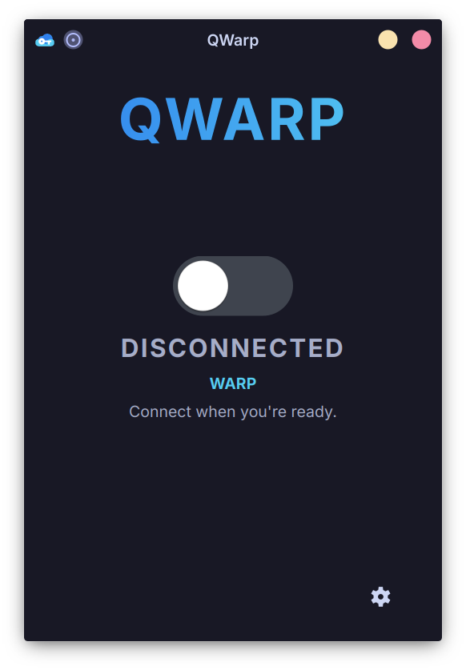
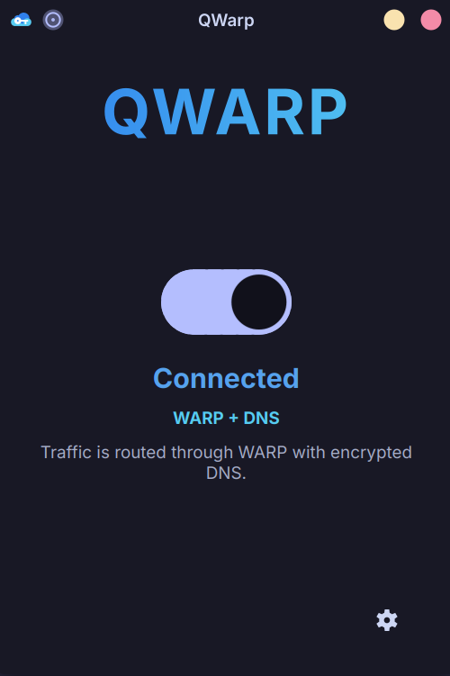
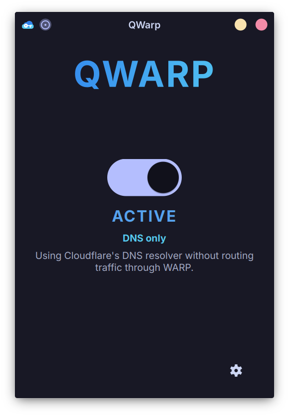
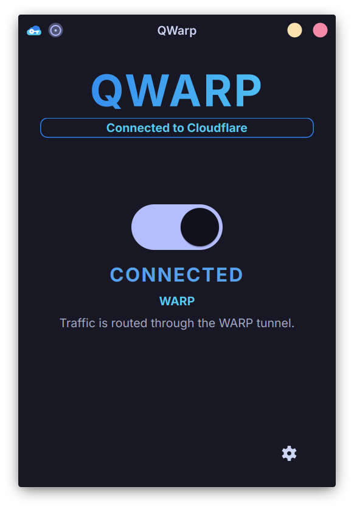

<div align="center">
  

# QWarp

A Qt6-based alternative desktop client for Cloudflare® WARP® on Linux.

[](https://github.com/iashutoshtiwari/qwarp/actions/workflows/ci.yml)
[](https://github.com/iashutoshtiwari/qwarp/releases/latest)
[](https://aur.archlinux.org/packages/qwarp)
[](LICENSE)

</div>

> [!IMPORTANT]
> QWarp is independently developed and is not affiliated with, authorized, sponsored, or endorsed by Cloudflare, Inc.
> It controls a separately installed official client and does not distribute or replace `warp-cli`, `warp-svc`, or
> software published by Cloudflare, Inc. See the project [trademark notice](TRADEMARKS.md).

Cloudflare, 1.1.1.1, WARP, and WARP+ are trademarks and/or registered trademarks of Cloudflare, Inc. in the United
States and other jurisdictions.

## Screenshots

<div align="center">
  
  
  
  
</div>

## Features

- **Registration & Enrollment:** Personal WARP registration and Cloudflare Zero Trust organization enrollment.
- **Routing & Modes:** Switch between 1.1.1.1 with WARP, DoH, DoT, WARP + DoH, WARP + DoT, Local Proxy, and Tunnel Only.
- **Protocol & Connectivity:** Support for MASQUE and WireGuard protocols, proxy port configuration, and trusted network auto-disconnect.
- **DNS Controls:** DNS content filtering (Off, Malware Only, Malware + Adult Content).
- **Split Tunneling:** Manage IP/network and hostname rules to route traffic outside the WARP tunnel (personal registrations).
- **Fallback Domains:** Configure local DNS resolver fallback domains.
- **Diagnostics:** Comprehensive overview of account status, organization policy, daemon state, network interfaces, and tunnel/DNS traffic statistics.
- **Native Desktop Integration:** Follows native KDE, GNOME, and system palettes in light and dark modes with theme-aware symbolic tray icons.
- **Display Support:** Full Wayland and X11 compatibility; graceful fallback when a system tray is unavailable.
- **Scriptable CLI:** Machine-readable `--status-json` query for headless or script-driven status inspection.
- **Localization:** Complete catalogs for English, German, Spanish, Portuguese, Italian, Simplified Chinese, Japanese, and Hindi.

## Requirements

- **Official Cloudflare WARP client:** QWarp requires a separately installed official Cloudflare WARP client (`warp-cli` and `warp-svc`). Consult Cloudflare's [Linux documentation](https://developers.cloudflare.com/warp-client/get-started/#linux) and [package repository](https://pkg.cloudflareclient.com/) for supported distributions and installation instructions.
- **Desktop Session:** A Wayland or X11 desktop session. A system tray is optional; the main window remains accessible if no tray is present.
- **System Services:** `systemd` and `pkexec` are used for daemon status checks and service control.
- **Python (Source/Development):** Python 3.11 or newer and PyQt6 (not required for the standalone binary).

## Installation

Install the official Cloudflare WARP client first, then install QWarp using the appropriate package for your system.

### Arch Linux (AUR)

QWarp is available in the Arch User Repository (AUR) and depends on the community-maintained `cloudflare-warp-bin` package:

```bash
yay -S qwarp
```

### Debian / Ubuntu (.deb)

Download `qwarp_0.10.1-1_all.deb` from the [latest release](https://github.com/iashutoshtiwari/qwarp/releases/latest), then install:

```bash
sudo apt install ./qwarp_0.10.1-1_all.deb
```

### Fedora (.rpm)

Download `qwarp-0.10.1-1.fc44.noarch.rpm` from the [latest release](https://github.com/iashutoshtiwari/qwarp/releases/latest), then install:

```bash
sudo dnf install ./qwarp-0.10.1-1.fc44.noarch.rpm
```

### Standalone Binary (x86_64)

Download `qwarp-0.10.1-linux-x86_64.tar.gz` and `SHA256SUMS` from the [latest release](https://github.com/iashutoshtiwari/qwarp/releases/latest):

```bash
sha256sum --ignore-missing --check SHA256SUMS
tar -xzf qwarp-0.10.1-linux-x86_64.tar.gz
./qwarp
```

## Usage and verification

Verify that both the official client and QWarp are functioning:

```bash
warp-cli --version
qwarp --version
qwarp --status-json
```

Launch QWarp from your desktop application launcher or run `qwarp` in a terminal.

If the WARP daemon service is inactive, start it with:

```bash
sudo systemctl enable --now warp-svc
```

### Command-line options

| Option              | Description                                                      |
| ------------------- | ---------------------------------------------------------------- |
| `-h`, `--help`      | Show CLI options and exit                                        |
| `--version`         | Show program version number and exit                             |
| `--status-json`     | Output machine-readable JSON status and exit                     |
| `--start-minimized` | Start minimized to system tray                                   |
| `--debug`           | Enable sanitized diagnostic logging                              |
| `--log-level`       | Set terminal log verbosity (`DEBUG`, `INFO`, `WARNING`, `ERROR`) |

## Development and contributing

See [CONTRIBUTING.md](CONTRIBUTING.md) for environment setup, tests, architecture rules, translations, and pull requests.

Run quality gates locally:

```bash
ruff check src/ tests/
ruff format src/ tests/ --check --diff
QT_QPA_PLATFORM=offscreen pytest tests/ -v --tb=short
python3 scripts/check_locales.py
```

Please use [GitHub Issues](https://github.com/iashutoshtiwari/qwarp/issues) for reproducible bug reports and feature requests.

## License

QWarp's original code is released under the [MIT License](LICENSE).

Bundled assets, third-party icons, and trademark details are documented in [TRADEMARKS.md](TRADEMARKS.md).

Maintained by [Ashutosh Tiwari](https://github.com/iashutoshtiwari).
